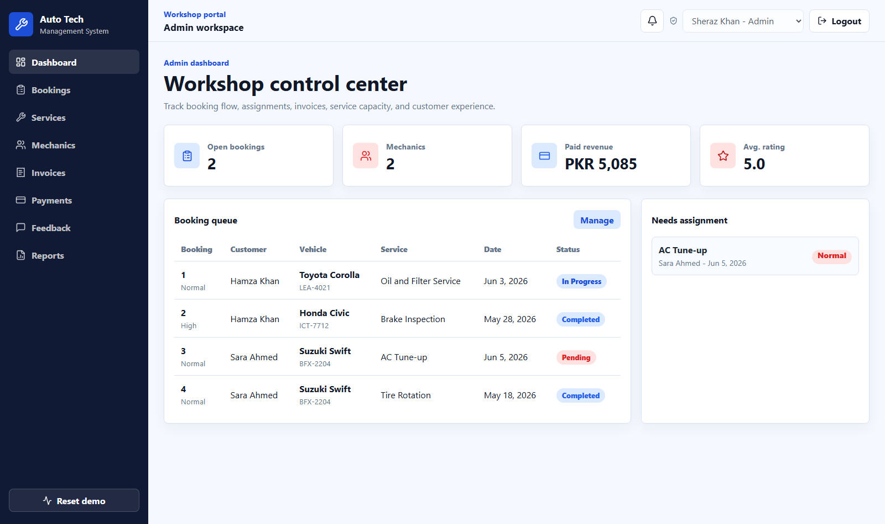
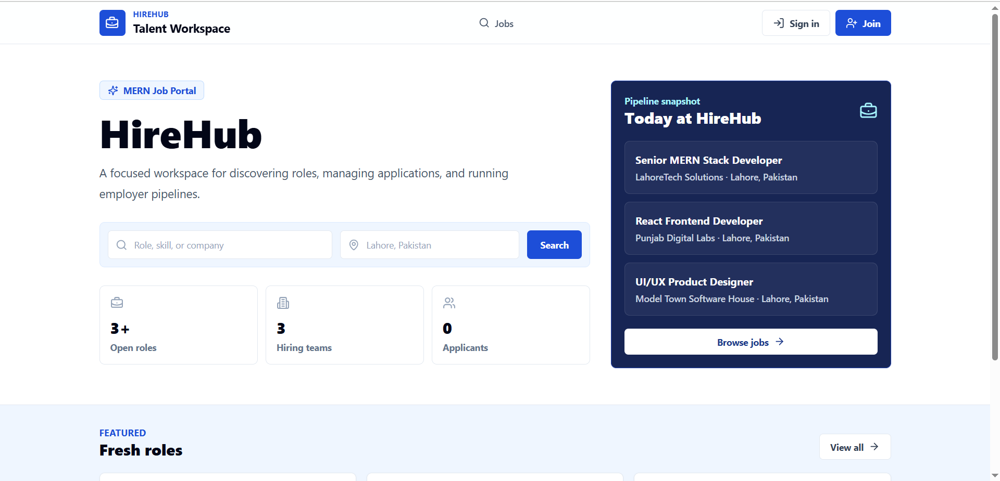
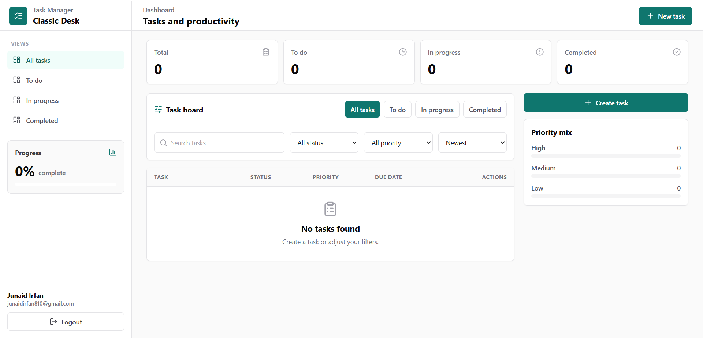

# Junaid Irfan Portfolio

A clean, recruiter-friendly portfolio for Junaid Irfan, a Lahore-based Full Stack MERN Developer building deployed dashboards, e-commerce projects, role-based portals, and AI-assisted web applications.

Live site: https://junaid-portfolio-two-phi.vercel.app/

## Highlights

- Based in Lahore, Pakistan - open to remote junior roles and freelance projects
- Separate About, Skills, Projects, Experience, and Education pages
- Light/dark mode with saved preference
- Profile photo logo and responsive mobile navigation
- Project screenshots, live links, source links, and outcome-focused descriptions
- Resume download served as PDF, not DOCX
- React.js app built with Vite, component-based pages, saved light/dark theme, and responsive routing

## Featured Projects

### Modern Animated MERN E-Commerce Store


Premium menswear e-commerce store with product catalog, cart, checkout, JWT-ready auth flow, user dashboard, and admin dashboard for products, categories, orders, sales, coupons, stock, banners, profit/loss, returns, and notifications.

Live: https://modern-store-e-commerce-client.vercel.app

### Auto Tech Management System



React vehicle service portal with role-based customer/admin dashboards, service booking, booking management, mechanic assignment, invoices, PKR payments, feedback, reports, and live Vercel deployment.

Live: https://autotechmanagementsystem.vercel.app  
Source: https://github.com/junaidirfan67/AutoTechmanagementsystem

### HireHub Job Portal



MERN job portal concept with job search, location filtering, featured roles, employer pipeline UI, and responsive talent workspace screens.

Live: https://lnkd.in/da95uY8H  
Source: https://github.com/junaidirfan67/hirehub

### Task Manager



Productivity dashboard with task creation, status views, priority filters, progress tracking, task counters, board controls, and a clean admin-style layout.

Live: https://lnkd.in/dnVkPFCK  
Source: https://github.com/Ali-Jun/Task-Manager

## Tech Stack

React.js, Vite, HTML5, CSS3, JavaScript, Node.js, Express.js, MongoDB, MySQL, Git, GitHub, Vercel, OpenAI, Claude, Codex, and DeepSeek.

## Local Setup

```bash
npm install
npm run dev
```

## Build

```bash
npm run build
```

The GitHub Pages-style build is generated in `docs/`. The Vercel build is generated in `dist/` when `VERCEL=1` is set. React page shells are emitted for About, Skills, Projects, Experience, and Education routes.

## Contact

Email: junaidirfan810@gmail.com  
LinkedIn: https://www.linkedin.com/in/junaid-irfan-ba1027241  
GitHub: https://github.com/junaidirfan67
